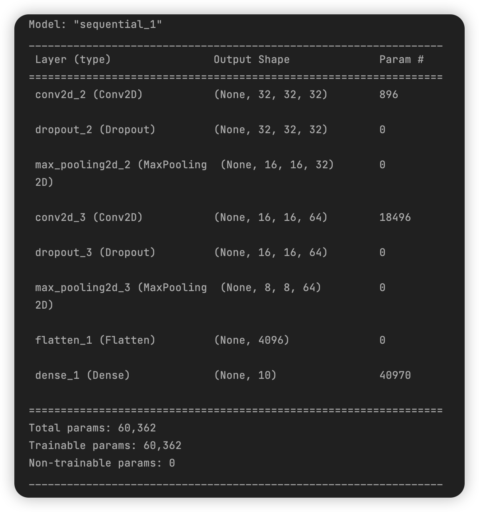
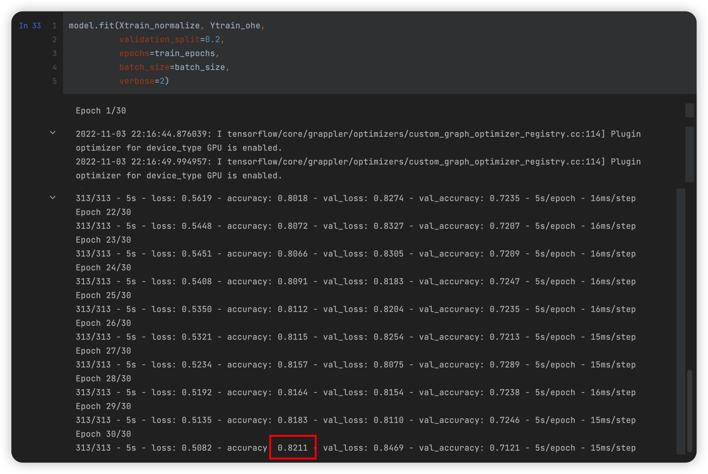
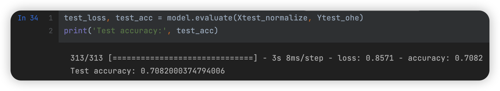
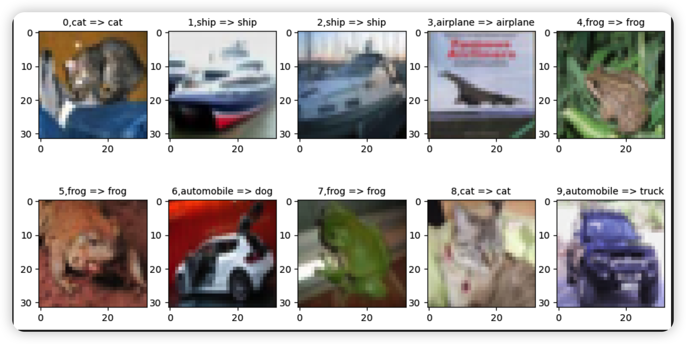

# 深度学习应用开发：作业六 CIFAR10案例卷积神经网络实践

| 课程 | 深度学习应用开发 |
| ---- | ---------------- |
| 学号 | 32001261         |
| 姓名 | 舒恒鑫           |
| 班级 | 计算机2004       |

## 作业要求

### 基本要求

可尝试采用不同的学习率、单批次样本数、训练轮数等超参数，或是改变模型结构（例如：增加卷积层、池化层或全连接层的数量）让模型的准确率达到70%。

### 提交要求

- 你认为最优的一次带运行结果的源代码文件（.ipynb 格式）
- 文件先压缩为rar或者zip文件，作为附件上传

### 评分标准

- 完成CIFAR10图像识别问题的卷积神经网络的建模与应用（必须采用卷积神经网络），有完整的代码，模型能运行，准确率达60%以上；得6分；每下降一个百分点，少得1分；
- 准确率达65%以上；再得2分，否则再得0分；
- 准确率到70%以上；再得2分，否则再得0分；
- 之所以只提70%的准确率作为满分的标准，不是说只能达到这个识别率，而是考虑同学们设备的算力和时间，有GPU的会很快，如果只是CPU的还是需要一些时间的。

## TensorFlow

**模型结构**



**超参数**

```python
train_epochs = 5
batch_size = 100
model.compile(optimizer='adam',
              loss='categorical_crossentropy',
              metrics=['accuracy'])
```

**结果**





**可视化结果**