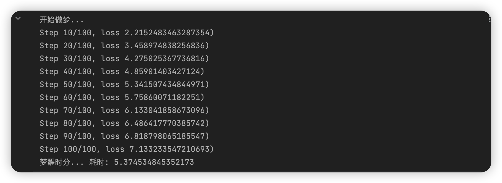
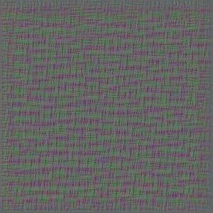
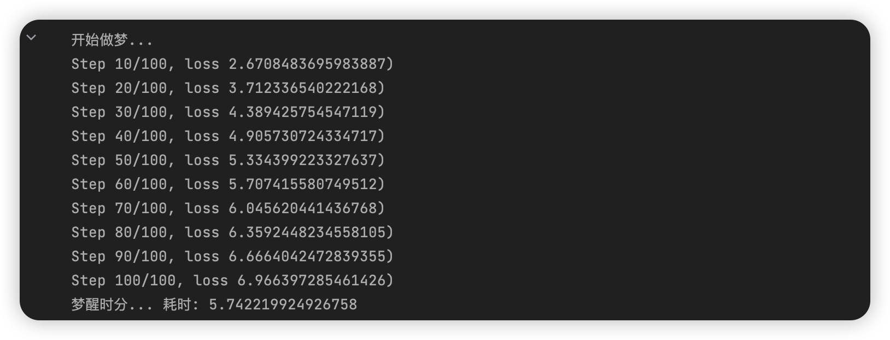
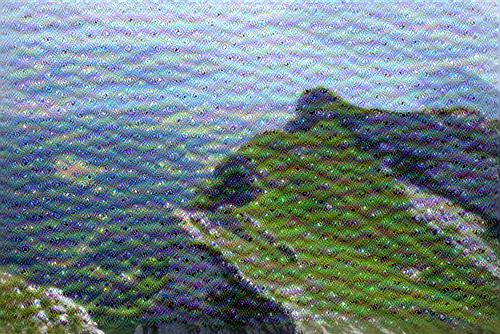
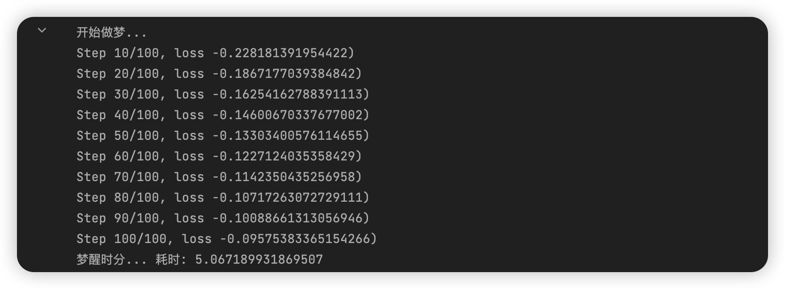
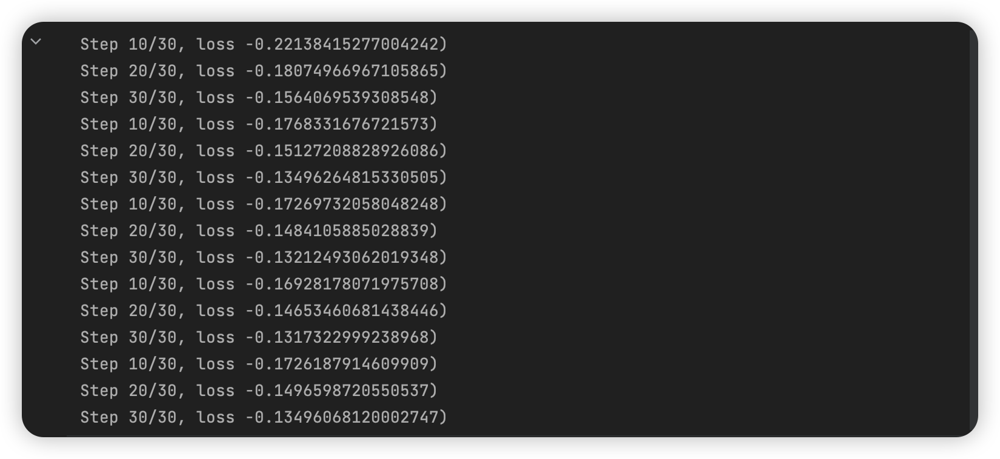
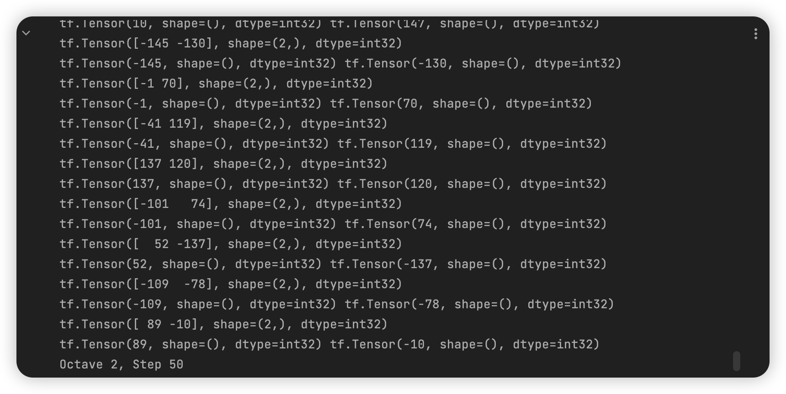

# 深度学习应用开发：作业七 Deep Dream图像生成的实践

| 课程 | 深度学习应用开发 |
| ---- | ---------------- |
| 学号 | 32001261         |
| 姓名 | 舒恒鑫           |
| 班级 | 计算机2004       |

## 作业要求

### 基本要求

按课程案例，生成DeepDream图像。

### 提交要求

1、你认为按评分标准能得分最高的一次带运行结果的源代码文件（.ipynb 格式）

2、作为附件上传（本次作业可以将多个.ipynb文件打包在一个压缩包里上传，注意文件命名）

### 评分标准

1. 完成DeepDream图像生成案例，有完整的代码，模型能运行；以噪音图像为优化起点，利用单通道特征，得6分；
2. 以噪音图像为优化起点，利用多通道特征，得7分；
3. 以背景图像（mountain风景画）为优化起点，利用单通道特征，得8分；
4. 以背景图像（mountain风景画）为优化起点，利用多通道特征，得9分；
5.  以背景图像（mountain风景画）为优化起点，利用多通道特征，并对图像生成质量进行改善，得10分。

## TensorFlow

### 噪音图像单通道特征

**这里指定层为 conv2d_15** 

### 噪音图像多通道特征

**这里指定层为 ['conv2d_15', 'conv2d_18']**

### 背景图像单通道特征

**这里指定层为 conv2d_15** 

### 背景图像多通道特征

**这里指定层为 ['conv2d_15', 'conv2d_18']**

![mountain_deep_dream_['conv2d_15', 'conv2d_18']](./images.assets/mountain_deep_dream_%5B%27conv2d_15%27,%20%27conv2d_18%27%5D.jpg)

### 优化背景图像多通道特征

#### 不同比例迭代进行

![mountain_deep_dream_optimization1_['conv2d_15', 'conv2d_18']](./images.assets/mountain_deep_dream_optimization1_%5B%27conv2d_15%27,%20%27conv2d_18%27%5D.jpg)

![dream_tile_octave_['conv2d_15', 'conv2d_18']](./images.assets/dream_tile_octave_%5B%27conv2d_15%27,%20%27conv2d_18%27%5D.jpg)