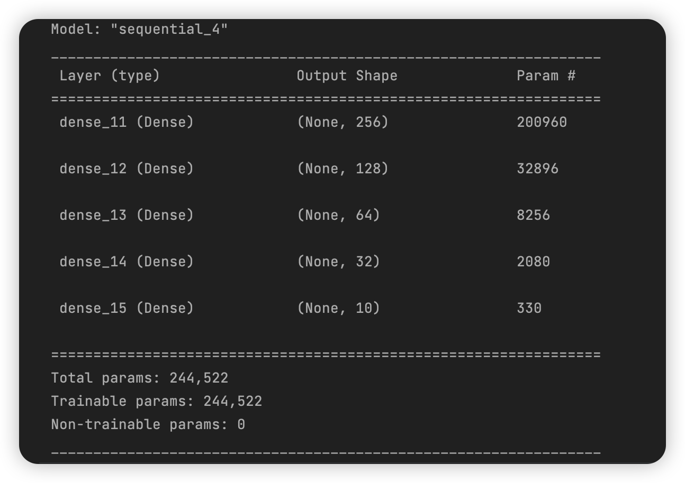
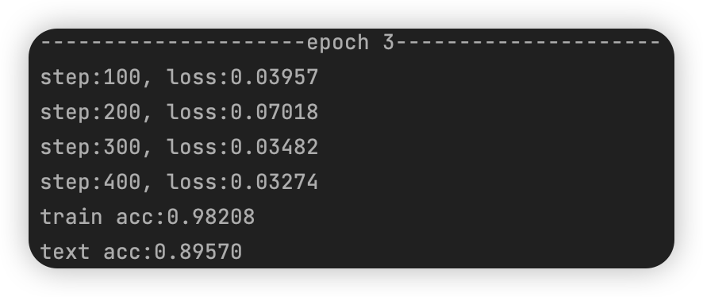
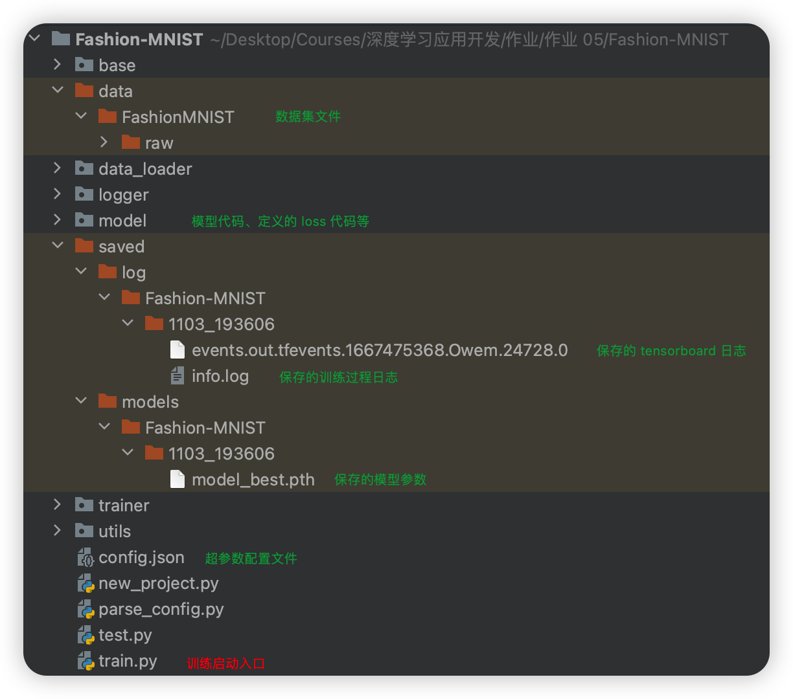
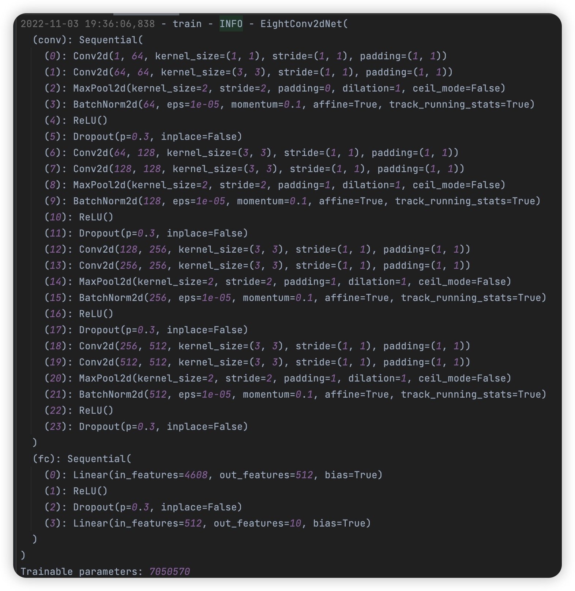
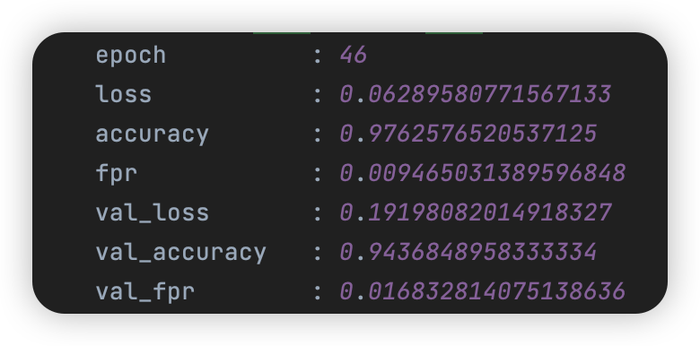
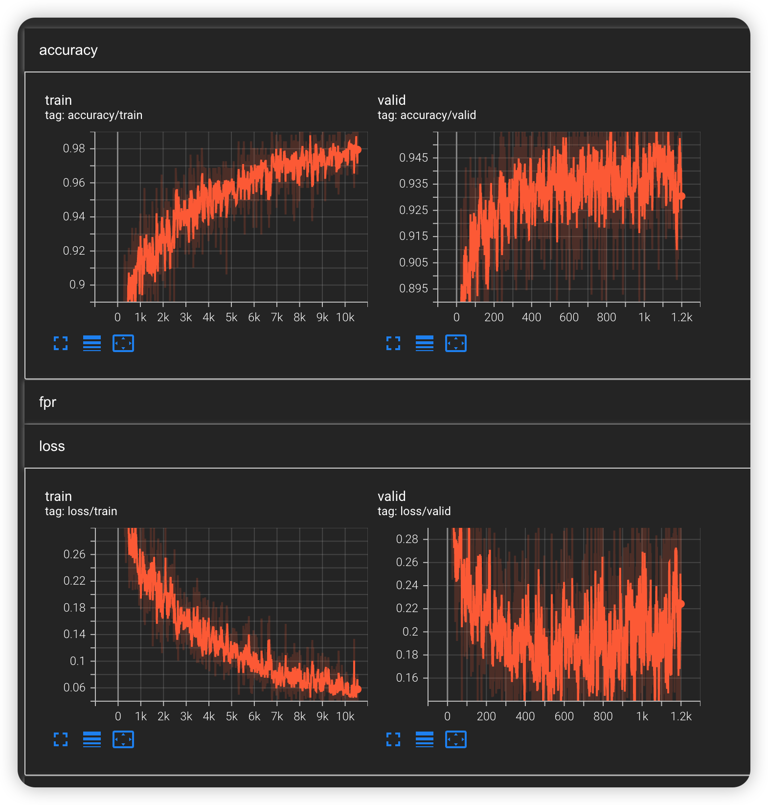

# 深度学习应用开发：作业五 Fashion-MNIST 图像识别问题的多层神经网络模型实践

| 课程 | 深度学习应用开发 |
| ---- | ---------------- |
| 学号 | 32001261         |
| 姓名 | 舒恒鑫           |
| 班级 | 计算机2004       |

## 介绍

Fashion-MNIST是德国研究机构Zalando Research在2017年8月份开源的一个数据集，它包含了如图13.7所示的人们日常穿着的衣服、鞋子、包等十类生活用品，其中训练集包含60000张训练集和10000张测试集，每张图片和MNIST数据集一样，均是28*28像素的灰度图，包括10个种类的生活用品（T-shirt/top, Trouser, Pullover, Dress, Coat, Sandal, Shirt, Sneaker, Bag, Ankle boot）。

Fashion-MNIST是一个开源的数据集，该机构在 https://github.com/zalandoresearch/fashion-mnist 

为了便于学习者学习，TensorFlow在datasets里面集成了Fashion-MNIST数据集。

```python
# 导入fashion mnist数据集的语句
fashion_mnist = tf.keras.datasets.fashion_mnist
(train_images, train_labels), (test_images, test_labels) = fashion_mnist.load_data()  
```

## 作业要求

### 基本要求

自行设计一种神经网络模型，并尝试采用不同超参数，让模型的准确率达到97.5%。

### 提交要求

- 你认为最优的一次带运行结果的源代码文件（.ipynb 格式）
- 文件先压缩为rar或者zip文件，作为附件上传

### 评分标准

- 完成Fashion-MNIST图像识别问题的神经网络建模与应用，有完整的代码，模型能运行，准确率达87%以上；得6分；每下降一个百分点，少得1分；
- 准确率达88%以上；再得2分，否则再得0分；
- 准确率到88.6%以上；再得2分，否则再得0分；

## 方法一：TensorFlow

**模型**



**超参数**

- batches = 128
- 优化器 Adam(learning_rate=1e-3)

**模型结果**



## 方法二：PyTorch

### 项目文件



> 注：由于文件过大，tensorboard 日志文件和模型参数文件不提供

### 实验结果与分析（最好成绩，其他记录可以查看“参数结果记录表.md”）

#### 模型参数

**模型**



**超参数**

```json
{
    "name": "Fashion-MNIST",
    "n_gpu": 1,
    "arch": {"type": "SixConv2dNet", "args": {"n": 0.5}},
    "data_loader": {
        "type": "FashionMnistDataLoader", 
        "args": {
            "data_dir": "data/", 
            "batch_size": 256, 
            "shuffle": true, 
            "validation_split": 0.1, 
            "num_workers": 2}},
    "optimizer": {"type": "Adam", "args": {
        "lr": 1e-4, 
        "weight_decay": 0, 
        "amsgrad": true}},
    "loss": "cross_entropy_loss",
    "metrics": ["accuracy", "fpr"],
    "lr_scheduler": {
        "type": "StepLR", 
        "args": {"step_size": 50, "gamma": 0.1}},
    "trainer": {
        "epochs": 1000,
        "save_dir": "saved/",
        "save_period": 1,
        "verbosity": 2,
        "monitor": "max val_accuracy",
        "early_stop": 10,
        "tensorboard": true}
}
```

**模型训练结果**



#### TensorBoard



显然可以看到：

- 测试集上 accuracy 已经达到 99% 以上，loss 在 0.04 以下
- 验证集上 accuracy 已经达到 94% 以上，loss 在 0.14 以下
