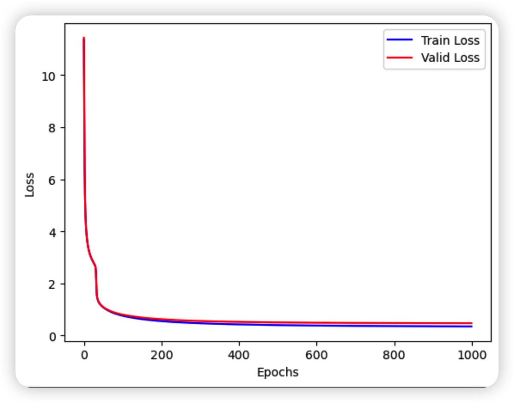
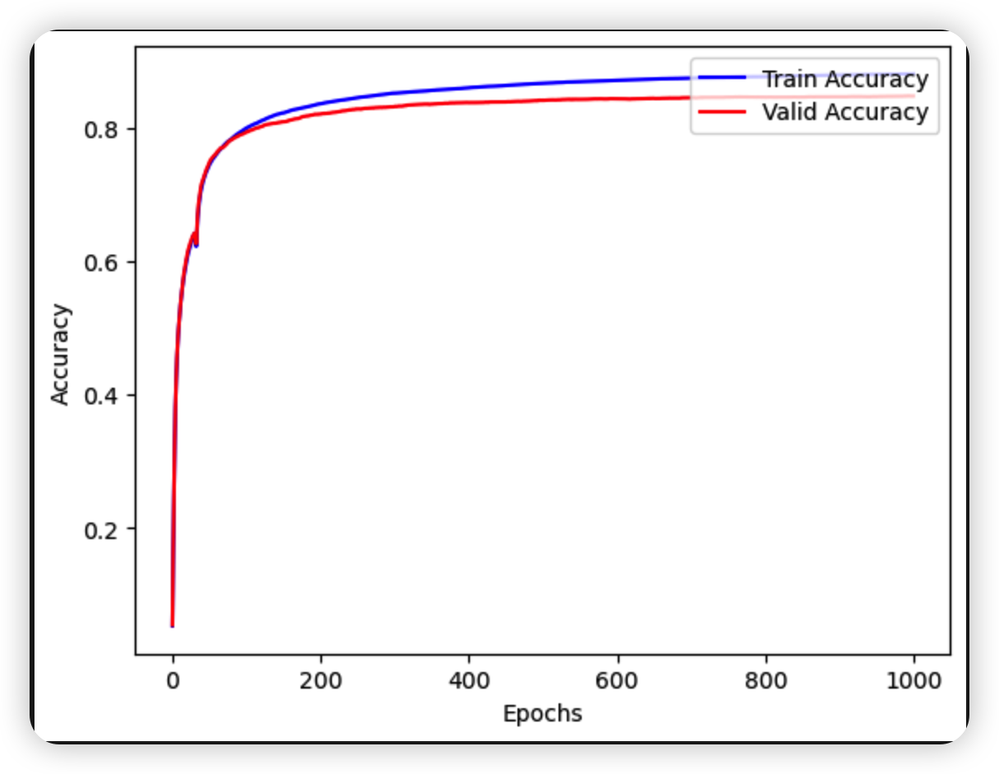

# 深度学习应用开发：作业四 FashionMNIST图像识别问题的神经元模型实践

| 课程 | 深度学习应用开发 |
| ---- | ---------------- |
| 学号 | 32001261         |
| 姓名 | 舒恒鑫           |
| 班级 | 计算机2004       |

## 介绍

Fashion-MNIST是德国研究机构Zalando Research在2017年8月份开源的一个数据集，它包含了如图13.7所示的人们日常穿着的衣服、鞋子、包等十类生活用品，其中训练集包含60000张训练集和10000张测试集，每张图片和MNIST数据集一样，均是28*28像素的灰度图，包括10个种类的生活用品（T-shirt/top, Trouser, Pullover, Dress, Coat, Sandal, Shirt, Sneaker, Bag, Ankle boot）。

Fashion-MNIST是一个开源的数据集，该机构在 https://github.com/zalandoresearch/fashion-mnist 

为了便于学习者学习，TensorFlow在datasets里面集成了Fashion-MNIST数据集。

```python
# 导入fashion mnist数据集的语句
fashion_mnist = tf.keras.datasets.fashion_mnist
(train_images, train_labels), (test_images, test_labels) = fashion_mnist.load_data()  
```

## 作业要求

### 基本要求

在不改变模型的结构基础上，尝试采用不同的学习率、单批次样本数、训练轮数等超参数，让模型的准确率达到83.5%。

### 提交要求

- 你认为最优的一次带运行结果的源代码文件（.ipynb 格式）
- 文件先压缩为rar或者zip文件，作为附件上传

### 评分标准

- 完成案例代码，有完整的代码，模型能运行，准确率达82%以上；得6分，否则得0分；
- ‌准确率达83.5%以上；再得2分，否则得0分；
- ‌画出训练过程的loss曲线和accuracy曲线；再得2分，否则得0分；

## 实验结果与分析

**超参数：**

```python
# 定义变量
W = tf.Variable(tf.random.normal([784, 10], mean=0.0, stddev=1.0, dtype=tf.float32))
B = tf.Variable(tf.zeros([10]), dtype=tf.float32)

training_epochs = 1000    # 训练轮数
batch_size = 2048         # 单次训练样本数（批次大小）
learning_rate = 0.001   # 学习率

optimizer = tf.keras.optimizers.Adam(learning_rate=learning_rate)
```


**Epochs-Loss图**



**Accuracy-Loss图**

