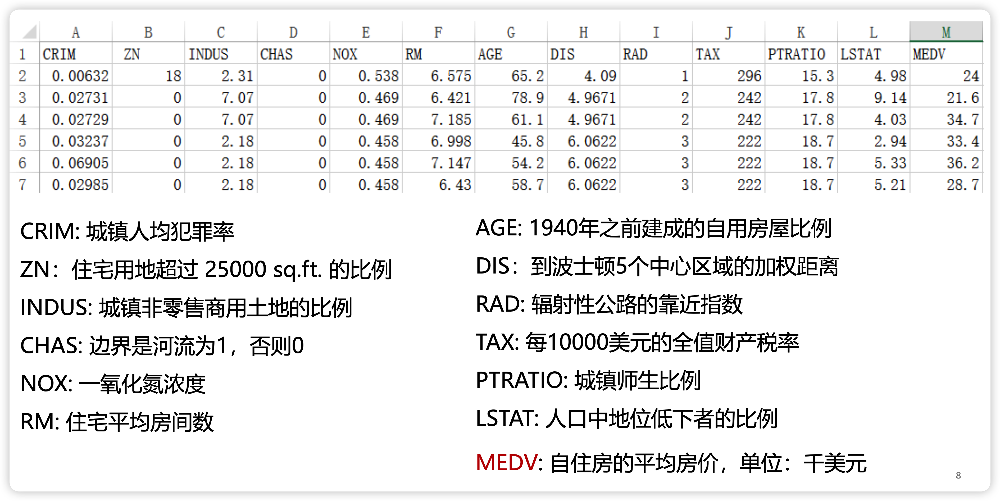
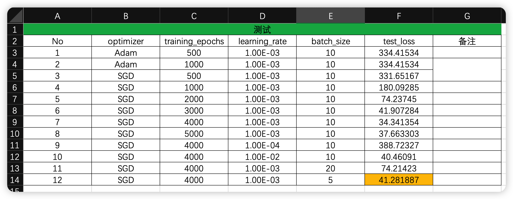

# 深度学习应用开发：作业三 波士顿房价预测线性回归实践

| 课程 | 深度学习应用开发 |
| ---- | ---------------- |
| 学号 | 32001261         |
| 姓名 | 舒恒鑫           |
| 班级 | 计算机2004       |

## 作业要求

### 基本要求

- 按课程案例，动手完成编码实践。
- 通过梯度下降优化器进行优化，尝试采用不同的学习率和训练轮数等超参数，记录训练后的损失值和W、b变量值。

### 提交要求

- 至少5次不同超参数的运行结果的记录文档（word格式或者txt格式）
- 你认为最优的一次带运行结果的源代码文件（.ipynb 格式）
- 以上两个文件一起压缩为一个压缩文件后作为附件上传

### 评价标准

- 完成案例中的代码，有完整的代码，模型能运行优化出结果，8分；
- 调整过超参数，记录文件中有至少5组数据，2分；

## 实验结果与分析

### 数据预处理

数据含义：



>  注意：这里的 csv 字段名需要进行修正

另外，我们看出来```boston.csv```数据有如下特征：

- 所有字段为数字型
- 没有缺失值
- 没有重复值
- 存在异常值（大于或小于 3sigma）

执行步骤：

1. 处理异常值
2. 进行标准化
3. 保存已经处理的数据

### 训练模型

